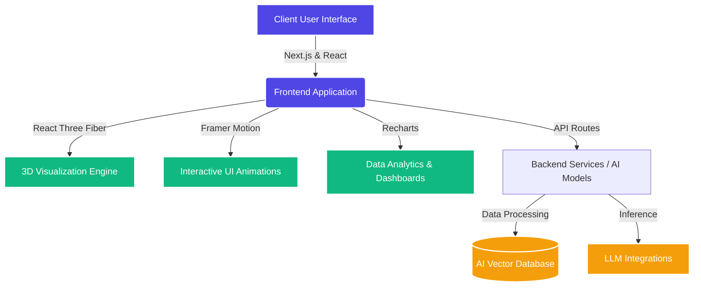

<div align="center">
  

  <h1>🚀 CodeBridge AI</h1>
  <p><em>Empowering the Next Generation of AI-Assisted Development</em></p>

  <p>
    <a href="https://github.com/your-username/codebridge-ai/stargazers"></a>
    <a href="https://github.com/your-username/codebridge-ai/network/members"></a>
    <a href="https://github.com/your-username/codebridge-ai/issues"></a>
    <a href="https://github.com/your-username/codebridge-ai/pulls"></a>
    <a href="https://opensource.org/licenses/MIT"></a>
  </p>
</div>

---

## 🌟 Overview

**CodeBridge AI** is a cutting-edge platform designed to bridge the gap between complex codebases and advanced artificial intelligence. Leveraging the power of modern web technologies, 3D visualization, and interactive data representations, CodeBridge AI offers an unparalleled experience for developers and AI enthusiasts alike.

We are building an open-source ecosystem that is highly extensible and community-driven. Our goal is to create the ultimate toolkit for AI integration in modern applications.

## 🏗 System Architecture & Flow

The architecture of CodeBridge AI is designed for scalability, performance, and real-time interaction. 



### Core Technologies
- ⚡ **Framework:** Next.js 14, React 18
- 🎨 **Styling:** TailwindCSS, Lucide React
- 🎥 **Animations:** Framer Motion
- 🧊 **3D Rendering:** Three.js, React Three Fiber, Drei
- 📊 **Data Viz:** Recharts

## 📸 Screenshots

*(Add screenshots of your amazing application here!)*
<div align="center">
  
</div>

## 🚀 Getting Started

Want to see CodeBridge AI in action? Follow these steps to get your local environment up and running fast.

### Prerequisites
- Node.js (v18 or higher)
- npm, yarn, pnpm, or bun

### Installation

1. **Clone the repository:**
   ```bash
   git clone https://github.com/your-username/codebridge-ai.git
   cd codebridge-ai
   ```

2. **Install dependencies:**
   ```bash
   npm install
   # or yarn install
   ```

3. **Start the development server:**
   ```bash
   npm run dev
   # or yarn dev
   ```

4. Open [http://localhost:3000](http://localhost:3000) in your browser.

## 🤝 How to Contribute

We ❤️ open source and actively welcome contributions! Whether you're fixing a bug, adding a feature, or improving documentation, we want your help to make CodeBridge AI the best it can be.

### Fast Contribution Workflow

1. **Fork** the repository and create your branch from `main`.
2. **Clone** your fork locally: `git clone https://github.com/your-username/codebridge-ai.git`
3. **Branch** out: `git checkout -b feature/amazing-feature`
4. **Commit** your changes: `git commit -m "feat: add amazing feature"`
5. **Push** to the branch: `git push origin feature/amazing-feature`
6. **Open a Pull Request**! 🚀

### Why Contribute?
- **Visibility:** Your code will be used by developers worldwide.
- **Learning:** Work with Next.js 14, React Three Fiber, and advanced animations.
- **Community:** Join a welcoming community of like-minded open-source enthusiasts.

## 📜 License

This project is licensed under the MIT License - see the [LICENSE](LICENSE) file for details.

---
<div align="center">
  Made with ❤️ by the open-source community.
</div>
